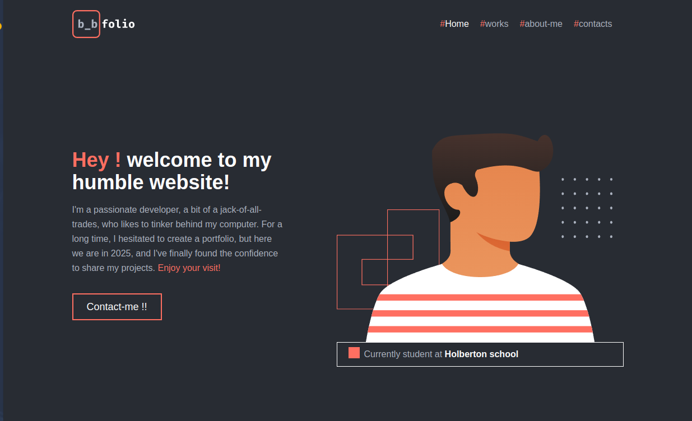

[app logo](./media/logoFullText_v2.svg)

This is the repository for my portFolio

## ️Setup

### Installation

To install this project, follow these steps:

1. Download the repository 

2. cd repository/portfolio

3. npm install

## Acknowledgements

- Css [tailwindcss](https://tailwindcss.com)
- Font [fira-code](https://fontmeme.com/polices/police-fira-code/)
- Icon [iconoir](https://iconoir.com)

## About the Author

**b_bel**

This project was created by b_bel. Connect with me on [GitHub](https://github.com/https://github.com/hardcodeur) and [LinkedIn](https://www.linkedin.com/in/bilal-belmehdi/)  to learn more about my projects and professional background.

